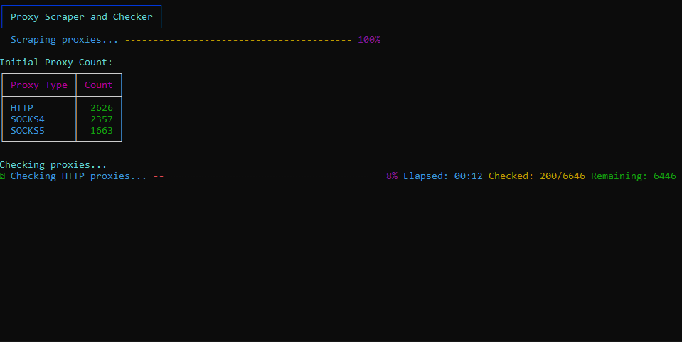

# 🌐 Proxy Scraper & Checker

A high-performance proxy scraping tool that collects and validates HTTP, SOCKS4, and SOCKS5 proxies from multiple sources.

## ✨ Features

- 🚀 Fast asynchronous proxy checking
- 🔄 Supports HTTP, SOCKS4, and SOCKS5 proxies
- 📊 Beautiful terminal UI with real-time statistics
- ⏱️ Live progress tracking and time monitoring
- 📁 Automatic sorting of working proxies into separate files
- 🔍 Validates proxies against major websites
- 💫 Concurrent proxy checking for maximum performance

## 📋 Requirements

Required packages:
- aiohttp
- requests
- beautifulsoup4
- rich

## 🚀 Usage

1. Clone the repository:
bash
git clone https://github.com/MathisDelrue/proxy-scraper
cd proxy-scraper

2. Install dependencies:
bash
pip install -r requirements.txt

3. Run the scraper:
bash
python main.py

## 📂 Output

The script automatically creates an `output` directory containing three files:
- `http.txt` - Working HTTP proxies
- `socks4.txt` - Working SOCKS4 proxies
- `socks5.txt` - Working SOCKS5 proxies

Each file contains one proxy per line in the format: `IP:PORT`

## 🖥️ Preview

## 🌟 Features in Detail

- **Multi-Source Scraping**: Collects proxies from various reliable sources
- **Concurrent Checking**: Checks multiple proxies simultaneously for faster results
- **Real-time Statistics**: Shows elapsed time, progress, and remaining proxies
- **Auto-Organization**: Automatically sorts working proxies by type
- **Error Handling**: Robust error handling for reliable operation
- **Clean UI**: Rich terminal interface with progress bars and statistics

## ⚙️ Configuration

The script includes several configurable parameters:
- Proxy sources can be modified in the `sources` list
- Concurrent checking batch size can be adjusted via `chunk_size`
- Timeout settings can be modified in the `check_proxy` method

## 📝 License

This project is licensed under the MIT License - see the [LICENSE](LICENSE) file for details.

## ⭐ Show your support

Give a ⭐️ if this project helped you!

